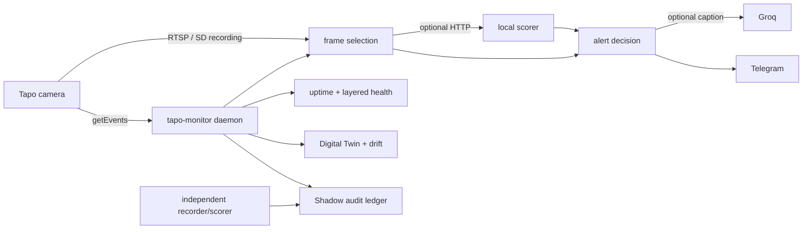

# tapo-monitoring

[](https://github.com/PeterkoCZ91/tapo-monitoring/actions/workflows/ci.yml)
[](https://www.python.org/)
[](LICENSE)

A lightweight, config-driven reliability and alerting stack for TP-Link Tapo PTZ cameras.
It combines camera control, on-device detection events, event-aligned frame selection,
optional local scoring, Telegram delivery and layered health monitoring in one tested
Python daemon.

> **Project status:** the core daemon and alert pipeline are operational and validated on
> the C560WS. Camera Digital Twin and Shadow Detection Auditor foundations are implemented
> behind opt-in flags. Camera models and firmware differ; unsupported capabilities degrade
> to `unknown` instead of being guessed.

## Why this project exists

[`pytapo`](https://github.com/JurajNyiri/pytapo) provides camera API operations.
[`HomeAssistant-Tapo-Control`](https://github.com/JurajNyiri/HomeAssistant-Tapo-Control)
exposes a broad Tapo feature set in Home Assistant. [Frigate](https://github.com/blakeblackshear/frigate)
is a complete local AI NVR. This project occupies a narrower space:

- run on modest hardware without requiring continuous local video inference;
- use the camera's on-device AI as the primary event source;
- encode Tapo-specific reliability knowledge such as login lockouts, sequential requests,
  SmartTrack ordering and SD recording freshness;
- treat an alert as successful only after the notification is delivered;
- distinguish network, API, events, RTSP and storage failures;
- measure desired configuration drift and, eventually, camera detection misses.

It is not a full NVR, video-management UI or replacement for Frigate. An optional local
recorder and scorer can complement the daemon, but neither is required for the basic flow.

## Highlights

- **One fleet daemon** — multiple cameras, one validated YAML configuration and one state
  machine per camera.
- **Low-login event polling** — `getEvents` is polled every few seconds on an existing
  session while reconnect/control runs on a slower interval.
- **Firmware-safe camera control** — day/night policy, people-only SmartTrack, presets,
  rain gating, sensitivity control and optional ONVIF soft pan limits.
- **Reliable event media** — live RTSP first, then an event-time SD-card or local-recorder
  follow-up when the first frame misses the subject; the subject zoom can be cropped from
  a native-resolution grab so a distant figure stays legible.
- **Optional local scorer** — a small HTTP YOLO service can gate frames and return subject
  boxes; Groq remains optional caption enrichment.
- **Confirmed Telegram semantics** — failed sends do not arm cooldowns; recovery, SD and
  sampler paths remain retryable.
- **It tells you when it stops working** — a dead-man's switch outside the main loop
  reports a daemon whose every tick is failing, because silence otherwise looks exactly
  like a quiet night.
- **Event-API watchdog** — separates `getEvents` failures from network reachability, reports
  recovery and can request one bounded API reboot per failure episode.
- **Camera Digital Twin** — redacted safe-getter snapshots, desired/actual drift and
  layered health without a second login loop.
- **Shadow Detection Auditor** — a private, media-free SQLite ledger correlates camera
  events with independent scorer/recorder observations.

See the complete [capability catalog](docs/capabilities.md) and
[architecture](docs/architecture.md).

## Quick start

Requirements: Python 3.10+, `ffmpeg`, a supported Tapo camera with third-party access, and
camera/RTSP credentials created in the Tapo app.

```bash
git clone https://github.com/PeterkoCZ91/tapo-monitoring.git
cd tapo-monitoring

python3 -m venv .venv
source .venv/bin/activate
pip install -e ".[dev]"

cp cameras.example.yaml cameras.yaml
$EDITOR cameras.yaml

export TELEGRAM_TOKEN=...
export TELEGRAM_CHAT_ID=...
export CAM_USER=...
export CAM_PASSWORD=...
export CAM_RTSP_USER=...
export CAM_RTSP_PASSWORD=...

tapo-monitor check cameras.yaml
tapo-monitor run cameras.yaml
```

The YAML contains environment-variable **names**, never secret values. `cameras.yaml`,
`.env` files and runtime media are git-ignored. Start from the
[configuration guide](docs/configuration.md), not by enabling every optional feature.

## Architecture at a glance



The fast event path and slower control/reconnect path are intentionally separate. A
camera that is pingable can still have a broken API, stale events or failed RTSP, so those
layers are observed independently. See [Architecture](docs/architecture.md) for timing,
failure containment and persistence.

## Event decision flow

1. Poll `getEvents` and decode the firmware's `events_1` bitmask.
2. Treat a camera-confirmed person differently from bare motion.
3. Capture a live RTSP frame and optionally score it locally.
4. If a confirmed event's frame is empty, queue an event-aligned SD/recorder follow-up.
5. Optionally crop and caption the chosen frame.
6. Send Telegram and advance cooldown state only after confirmed delivery.
7. Record the branch in the structured audit stream and optional private ledger.

This separation matters: a camera event says that something happened, not that the first
available frame contains the subject.

## CLI

| Command | Purpose |
| --- | --- |
| `tapo-monitor check [cameras.yaml]` | Validate configuration and print the fleet summary. |
| `tapo-monitor run [cameras.yaml]` | Start the daemon. |
| `tapo-monitor status [health.json]` | Inspect observed uptime, outages and reconnects offline. |
| `tapo-monitor audit-log [logfile\|-]` | Summarize event/scorer/Telegram audit records. |
| `tapo-monitor twin-status [twin.json] [--json]` | Inspect layered health and config drift offline. |
| `tapo-monitor probe [cameras.yaml] [--camera N] [--json]` | Probe cameras now; opens its own authenticated session. |
| `tapo-monitor shadow-record ...` | Ingest one independent media-free observation. |
| `tapo-monitor shadow-report ...` | Correlate camera and shadow observations. |

## Optional local scorer

Install scorer dependencies and run the stateless HTTP service on the same host or a
stronger machine:

```bash
pip install -e ".[scorer]"
python -m tapo_monitor.scorer_service --model /path/to/model.onnx --port 8766
```

Then set the camera's `scorer.url`. If the scorer is unavailable, the alert pipeline
degrades to unfiltered passthrough rather than silently dropping camera-confirmed people.
The configured threshold gates on **person** confidence; animal confidence never sends an
alert by itself, but a confident animal score marks the caption with a paw so a dog walker
is not indistinguishable from a lone figure. Tiled inference and optional subject cropping
help with distant subjects in wide views. The scorer also exposes
aggregate-only runtime counters at `/metrics` for operational monitoring.

Two opt-in calibration aids help tune thresholds by frame rather than by guesswork: an
archive of every photo sent to Telegram (`TAPO_SENT_LOG_DIR`, self-pruning) and
`python -m tapo_monitor.scene_probe`, which scores a live frame internally without alerting.
See [Operations](docs/operations.md#inspecting-alert-frames).

## Safety and privacy

- No credentials, coordinates, camera addresses or face mappings belong in the repository.
- Runtime state is stored under the XDG state directory with private file permissions.
- Digital Twin snapshots are recursively redacted and use a fixed safe-getter allow-list.
- The Shadow ledger stores timestamps and normalized metadata, never frames or stream URLs.
- Siren, floodlight and speaker actuators are intentionally not implemented.
- Repeated authentication failures use backoff because affected firmware can lock out the
  source address.

Do not run multiple camera-control integrations against the same device unless you
understand the session and sequential-request limitations.

## Documentation

| Document | Start here when… |
| --- | --- |
| [Documentation index](docs/README.md) | You want a map of all public docs. |
| [Configuration](docs/configuration.md) | You are preparing `cameras.yaml` and environment variables. |
| [Architecture](docs/architecture.md) | You want component boundaries, timing and failure semantics. |
| [Operations](docs/operations.md) | You are deploying, monitoring or calibrating a live instance. |
| [Capabilities](docs/capabilities.md) | You need the implemented/planned feature inventory. |
| [Observability](docs/observability.md) | You are enabling Digital Twin or Shadow Auditor. |
| [Troubleshooting](docs/troubleshooting.md) | You hit authentication, RTSP, SD or firmware-specific problems. |
| [`events_1` bitmask](docs/events1-bitmask.md) | Your firmware returns incomplete event types. |
| [Roadmap](docs/roadmap.md) | You want current gaps and planned product phases. |

## Development

```bash
pytest -q
ruff check .
```

Pure planning, classification, drift, matching and persistence logic is tested without
camera hardware; I/O collaborators are injected in tests. CI runs tests and Ruff for every
push to `main` and every pull request.

See [Contributing](CONTRIBUTING.md), [Security](SECURITY.md), the [changelog](CHANGELOG.md)
and the [MIT license](LICENSE).
