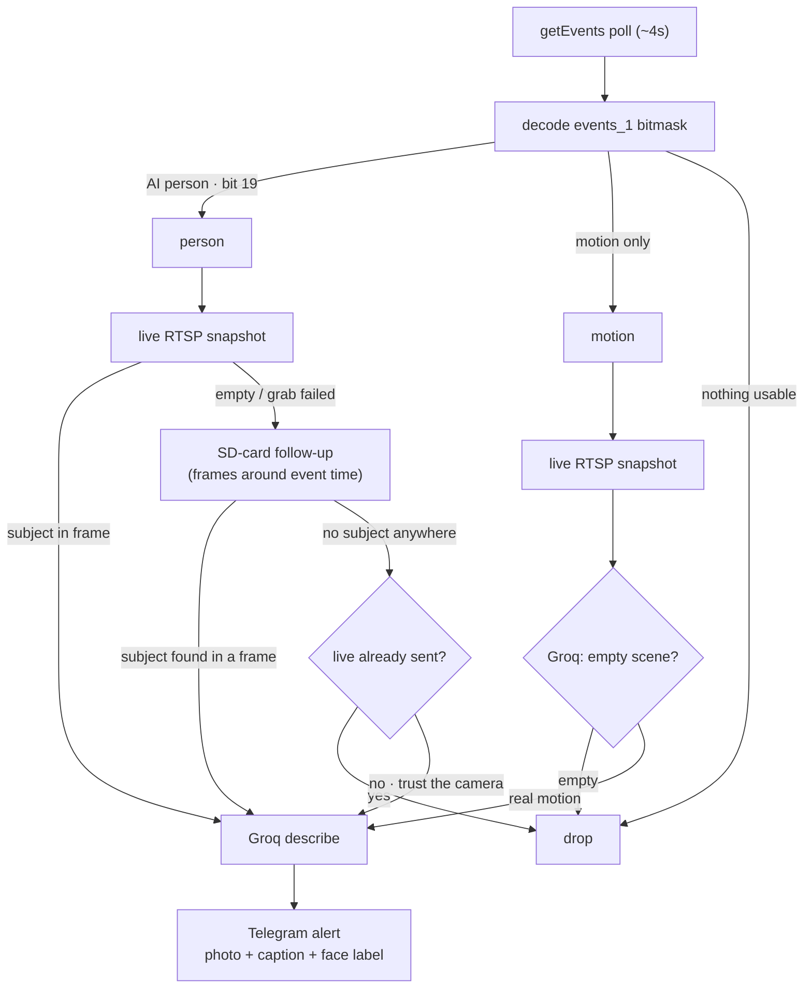
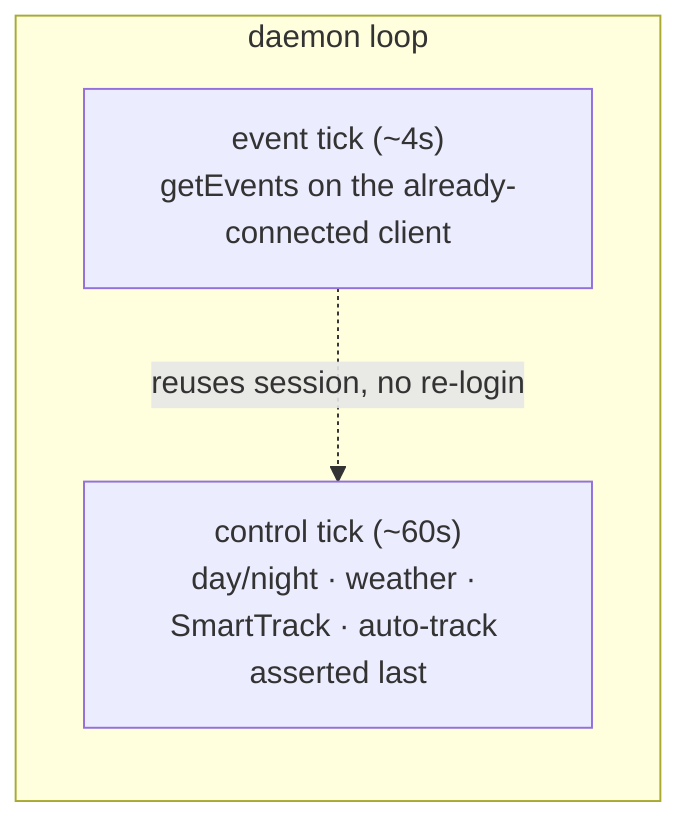

# tapo-monitoring

A config-driven monitoring stack for TP-Link Tapo PTZ cameras (developed and validated
on the C560WS). It detects people from the camera's on-device AI, optionally describes the
scene with an AI vision model, and sends Telegram alerts — running happily on a Raspberry Pi.

> **Status:** a single library (`tapo_monitor`) plus one config-driven daemon
> (`tapo-monitor run`). The day/night/rain camera control and the detection →
> enrich → notify pipeline both run in the daemon loop today. See
> [`docs/capabilities.md`](docs/capabilities.md) for the full capability catalog.

## Where this fits

This is a **lightweight alternative to a full NVR**, not a replacement for one. If you
have a Tapo PTZ camera and a Raspberry Pi and you want smart person alerts in Telegram
*without* standing up Frigate or a GPU/Coral box, this is for you. It:

- **trusts the camera's own on-device AI** for detection — there is no local
  object-detection model to run, so it fits on hardware as small as a Pi Zero 2 W;
- uses a **cloud vision model (Groq) only as optional enrichment** — it captions a
  camera-confirmed person and acts as a second opinion on bare motion, but never as the
  gate that decides whether a confirmed person is real;
- **bundles camera control** (auto-track, day/night scheduling, weather gating) *with* the
  detection → alert pipeline in one small daemon, where most projects do only one of the two.

It is deliberately **not** Frigate: no local inference, no zones, no recording/NVR, no
fancy hardware. If you need those, run Frigate. If you want a few hundred lines of tested
Python that turns a Tapo camera + a Pi into reliable Telegram person alerts, start here.

## What it does

- **Day/night scheduling** from astral sunset/sunrise (coordinates from config), with a
  fixed HH:MM fallback. One source of truth shared by every component.
- **Auto-tracking** with people-only SmartTrack at night and a static preset by day,
  applied in a firmware-safe order (SmartTrack/sensitivity/preset first, auto-track
  asserted last — the C560WS drops the master switch otherwise).
- **Detection** from the camera's on-device AI via `getEvents`: the `events_1` bitmask is
  decoded into named signals (motion / PIR / person) and only AI-confirmed people (bit 19)
  or recognized faces alert under `strict_people`. ONVIF and motion classifiers exist in
  `detection.py` for future wiring.
- **Face labelling** — `event_info[].face_id` is mapped to names via a configured env var;
  unrecognized but stable IDs show as "unknown face".
- **Fast detection loop** — event polling (`getEvents`, every ~4 s) is decoupled from
  camera control (tracking/sensitivity/preset, every ~60 s) so a person is seen within
  seconds *without* re-logging in each tick, which would risk the C560WS lockout.
- **Snapshot capture, live + SD hybrid** — a detection first grabs a live RTSP frame; a
  bare live grab often *misses* the subject (the camera fires on motion start, the person
  walks into view seconds later), so for a confirmed person the daemon can follow up with
  frames pulled from the camera's **SD-card recording** around the event time and pick the
  one the subject is actually in — turning a blank ping into an in-frame photo.
- **AI descriptions** of detections via Groq vision on the chosen snapshot (scaled);
  frames the model reports as an empty scene are dropped instead of alerted.
- **Weather gating** — in the rain, lower motion sensitivity, **park the PTZ**
  (`storm_park`) and/or pause auto-tracking so the camera stops chasing raindrops and wet
  branches (open-meteo, cached, with hysteresis).
- **Telegram alerts** for detections (rate-limited per camera) plus operational
  camera-down 🔴/🟢 notifications.
- **Audit logging** — every camera event is logged with its decoded signal, `alarm_type`,
  face count and the resulting verdict (person / drop), so detection behaviour is always
  auditable.
- **Multi-camera** from one config; perimeter hand-off between grouped cameras (planned).

## How it works

Every tick the daemon polls the camera's AI events, decides whether it's a person or bare
motion, grabs the best photo it can, optionally captions it, and alerts — with an SD-card
follow-up as the safety net when a live grab misses the subject:



Detection is deliberately **decoupled** from camera control so people are seen fast without
risking the login lockout:



A camera-confirmed person is **always** sent — Groq only adds a caption and is never the
gate that decides whether a confirmed person is real. Groq *is* the gate for bare motion,
which is a frequent false positive on its own.

## Privacy

This is **passive surveillance only** — it observes and notifies; it never triggers the
camera's siren/floodlight/speaker. No personal data lives in the repository: coordinates,
hostnames, face names and secrets all come from your own configuration. Copy
[`cameras.example.yaml`](cameras.example.yaml) to `cameras.yaml` (git-ignored) and fill in
your values; point secret fields at environment variable names rather than inlining tokens.

## Quickstart

```bash
pip install -e ".[dev]"          # install the package + dev tools
cp cameras.example.yaml cameras.yaml
$EDITOR cameras.yaml             # set hosts, coordinates, capabilities
export TELEGRAM_TOKEN=... TELEGRAM_CHAT_ID=... GROQ_API_KEY=...

tapo-monitor check cameras.yaml  # validate config + print a summary
tapo-monitor run cameras.yaml    # start the daemon
pytest -q                         # run the test suite
```

A systemd template is in [`systemd/tapo-monitor.service`](systemd/tapo-monitor.service).
Secrets are read from the environment variables named in `cameras.yaml` (e.g.
`TELEGRAM_TOKEN`), so the config file itself stays safe to share.

## Camera prerequisites & auth

Tapo cameras gate their local API; expect these one-time steps:

- **Enable third-party access.** Recent firmware refuses local logins unless
  *Tapo Lab → Third-Party Compatibility* is turned on in the Tapo app (some models
  instead require the camera to be blocked from the internet). Without it, every login
  fails.
- **Create a dedicated camera account.** In the Tapo app, *Advanced Settings → Camera
  Account*, set a username/password. These are the credentials the package logs in with
  (`user_env` / `password_env`) and the RTSP account (`rtsp_user_env` /
  `rtsp_password_env`) — usually the same pair.
- **Cloud password.** A few operations (notably SD-card clip download) need your TP-Link
  *account* password, not the camera account — set `cloud_password_env` if you use them.
- **Lockout.** Repeated failed logins lock out the source IP for ~30 minutes, and the
  first login right after a reconnect often fails before a retry succeeds. The daemon
  retries with exponential backoff so it never hammers a struggling camera — but double-
  check credentials before restarting in a loop.
- **RTSP.** Frames are pulled over RTSP (`stream1` HD, `stream2` SD) on port 554 by
  default; override with `rtsp_stream` / `rtsp_port`.

## The Tapo `events_1` bitmask

The camera's `getEvents` API is how the on-device AI reports activity — but on the C560WS
many events arrive with `event_type = None`, and the only usable signal is the integer
`events_1` **bitmask**. This field is barely documented anywhere, so the values below were
reverse-engineered from ~24 h of real captures across two C560WS cameras. `tapo_monitor`
decodes it in [`detection.decode_events_1()`](tapo_monitor/detection.py) and logs every
event's decoded flags (see *Audit logging*) so the still-unmapped bits can be ground-truthed
from your own traffic.

A single event can carry several bits at once — e.g. `events_1 = 524290` is bits 19 **and**
1, i.e. an AI person who is also moving.

**Confirmed bits**

| bit | value | meaning | notes |
|----:|------:|---------|-------|
| 1   | 2        | motion          | basic/software motion; a frequent false positive on its own |
| 5   | 32       | PIR sensor      | named by the firmware docs, but **never once observed firing** in our `getEvents` captures |
| 19  | 524288   | AI person       | the on-device AI confirmed a person — this is what `strict_people` alerts on |

**Observed but not yet ground-truthed** (reported as `unknown_bits` rather than guessed at):

| bit | value | correlated `alarm_type` | suspected (unconfirmed) |
|----:|------:|------------------------:|-------------------------|
| 3   | 8     | 4 | another AI category |
| 7   | 128   | 8 | **vehicle** — by far the most common non-person event |
| 8   | 256   | 9 | pet / line-crossing? |

`alarm_type` correlates with the bits above; in our data `alarm_type = 2` accompanies the
motion/person class, while `4 / 8 / 9` line up with bits `3 / 7 / 8`. These mappings are
empirical, not from a spec — treat the unconfirmed rows as hypotheses and verify against the
audit log before relying on them. If your captures pin down bits 3/7/8, a PR updating this
table is very welcome.

## Hard-won gotchas (pytapo + C560WS)

These cost real debugging time and are barely documented anywhere. If you're building your
own stack on `pytapo`, these are the landmines:

- **`setSmartTrackConfig` silently clears the auto-track master switch.** Set SmartTrack
  categories / presets / sensitivity *first* and assert `setAutoTrackTarget` **last** (and
  read it back to verify). Otherwise the camera looks configured but never tracks. See
  [`tracking.py`](tapo_monitor/tracking.py) (`ensure_autotrack`).
- **SD-card / media download fails with *"Cannot run the event loop while another loop is
  running"* (and a *"coroutine 'Transport.authenticate' was never awaited"* warning).**
  A long-lived `getEvents` client leaves pytapo's event-loop state in a way that makes the
  media stream download fall into a broken auth path and silently return nothing. Fixes,
  all in [`sdclip.py`](tapo_monitor/sdclip.py): run the download in a **fresh subprocess**
  with its own freshly-logged-in client; **pre-warm `getUserID()`** before entering the
  download loop (it calls it internally otherwise, from inside the running loop); and use
  **`window_size=50`** — pytapo's default `200` makes the C560WS stop sending mid-segment.
- **A live RTSP grab usually misses the subject.** The camera fires the event at *motion
  start*, but a person often only walks into clear view 15–25 s later, so a frame grabbed
  "now" is empty. Pull frames from the **recorded SD segment around the event time** and
  let the vision model pick the one the subject is in, rather than trusting the live grab.
- **First login right after a reconnect fails with *"Invalid authentication data"*** — a
  retry succeeds. Repeated failed logins **lock out the source IP for ~30 min**, so back
  off rather than hammering. Centralized in [`camera.py`](tapo_monitor/camera.py).
- **`setMotionDetection(sensitivity="60")` with a *string* is remapped to `"high"` (digital
  80) — the opposite of intent.** pytapo maps numeric strings through a label lookup; pass
  an **`int`** to set the digital value exactly. Same trap for `setPersonDetection`.
- **`event_type` is often `None` on the C560WS** — the only usable detection signal is the
  integer `events_1` bitmask (decoded above).

## Layout

```text
tapo_monitor/            # the library + daemon
  config.py              # validated config model loaded from cameras.yaml
  scheduling.py          # astral day/night (+ HH:MM fallback)
  weather.py             # rain gating (cached, hysteresis); coordinates from env
  tracking.py            # auto-track / SmartTrack decisions + firmware-safe apply
  detection.py           # event classification + events_1 bitmask decode
  snapshot.py            # live RTSP frame capture (ffmpeg)
  sdclip.py              # SD-card segment download + frame extraction around an event
  enrich.py              # Groq scene description + face labelling + frame selection
  notify.py              # Telegram + camera-down watchdog + alert gating
  camera.py              # lockout-aware pytapo connect + getEvents helpers
  monitor.py             # detection pipeline (collect → snapshot → enrich → notify)
  daemon.py              # per-camera state machine tying control + pipeline together
  cli.py                 # `tapo-monitor check|run`
cameras.example.yaml     # configuration schema (placeholders only)
docs/capabilities.md     # what Tapo detection can do + what this project adds over pytapo
systemd/                 # unit templates (generic; %i user, env-driven)
tests/                   # pytest suite
```

## Development

`pytest -q` runs the suite; `ruff check .` lints. CI runs both on every push and PR.

See [`CONTRIBUTING.md`](CONTRIBUTING.md) and [`SECURITY.md`](SECURITY.md). Licensed under
the terms in [`LICENSE`](LICENSE).

## Questions & community

Setup help, usage questions, or sharing what you've learned about your camera (especially
new `events_1` / `alarm_type` findings) — head to
[**Discussions**](https://github.com/PeterkoCZ91/tapo-monitoring/discussions). Bug reports
and feature requests belong in [Issues](https://github.com/PeterkoCZ91/tapo-monitoring/issues).
