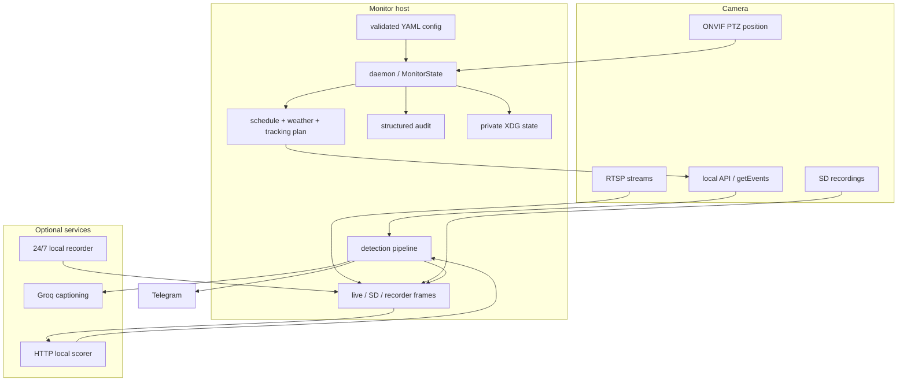
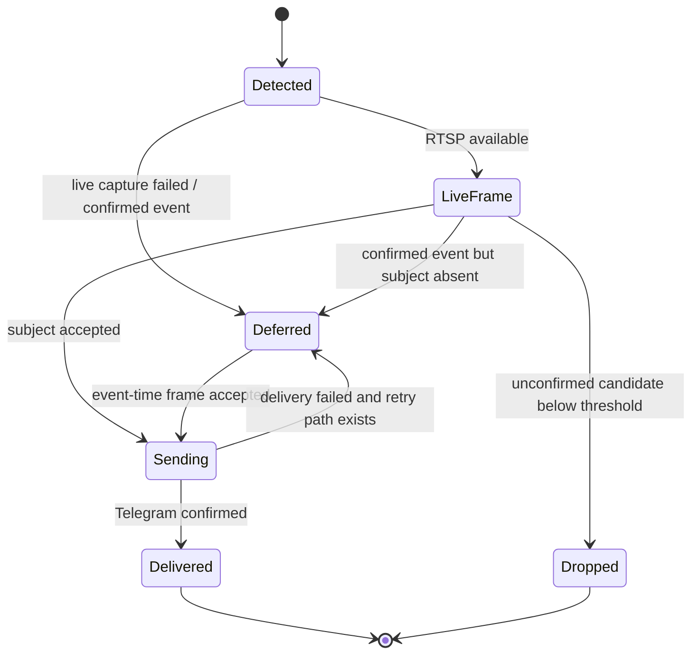

# Architecture

tapo-monitoring is a small camera reliability and alerting control plane. It intentionally
does not own a complete video-management lifecycle: the camera remains the primary event
detector, while optional scorer and recorder services improve evidence quality.

## Design goals

- Keep event latency low without repeatedly authenticating to the camera.
- Separate physical reachability from API, event, media and storage health.
- Preserve camera-confirmed detections through transient scorer, snapshot or Telegram
  failures.
- Encode known firmware ordering and timing constraints in one place.
- Keep every optional subsystem failure-contained.
- Store secrets outside configuration and keep observability media-free.
- Make policy and matching logic testable without camera hardware.

## Non-goals

- A full NVR, timeline UI or long-term video library.
- Continuous local inference on every frame.
- Guaranteed support for every Tapo model/firmware combination.
- Automatic firmware upgrades, SD formatting, calibration or destructive recovery.
- Active alarm actions such as siren, speaker or floodlight control.

## Components

The package modules follow these boundaries:

| Area | Main modules | Responsibility |
| --- | --- | --- |
| Configuration | `config.py` | Parse and validate YAML; resolve secret values from named environment variables. |
| Camera transport | `camera.py` | Ping, lockout-aware connect and event watermark helpers. |
| Control policy | `scheduling.py`, `weather.py`, `tracking.py`, `panlimit.py` | Build and safely apply camera plans. |
| Detection | `detection.py`, `monitor.py`, `daemon.py` | Classify events, gate alerts and coordinate retries. |
| Media | `snapshot.py`, `sdclip.py`, `recclip.py`, `sampler.py` | Capture live or event-aligned candidate frames. |
| Enrichment | `scorer.py`, `scorer_service.py`, `enrich.py` | Local subject confidence/boxes and optional captions. |
| Delivery | `notify.py` | Telegram API and delivery-aware state transitions. |
| Health | `health.py`, `capabilities.py`, `drift.py`, `twin.py` | Uptime, safe capability snapshots, layered health and desired-state drift. |
| Audit | `audit.py`, `ledger.py` | Human log summaries and media-free camera/shadow correlation. |
| CLI | `cli.py` | Daemon entry point and offline status/report commands. |

## Two loop cadences

The daemon avoids coupling detection latency to camera authentication.

### Control pass

Runs on `loop.control_interval` (default 60 seconds):

1. ping each camera without authentication;
2. apply reconnect backoff after API/authentication failures;
3. create or refresh one authenticated client;
4. calculate the day/night/weather `CameraPlan`;
5. apply sensitivity, night mode, person/vehicle policy, preset and SmartTrack in a
   firmware-safe sequence;
6. assert auto-track last and verify it;
7. update outage state and notifications;
8. optionally collect a low-frequency Digital Twin snapshot using the same client.

### Event pass

Runs on `loop.event_interval` (default 4 seconds) using the connected client:

1. poll `getEvents` and advance a per-camera watermark;
2. decode `events_1` and classify alert candidates;
3. apply event-time and wall-clock cooldown gates;
4. acquire/score media and attempt notification;
5. advance delivery state only when the event is handed to an owned retry path or
   Telegram confirms success;
6. process due sampler and SD/local-recorder jobs;
7. run the optional ONVIF soft pan guard.

The event pass never creates a new camera login. This is central to both low latency and
lockout avoidance.

## Alert reliability model

Important invariants:

- Camera-confirmed people are not silently discarded because one scorer call failed.
- Scorer unavailability fails open; it may add noise but does not hide a person.
- A failed Telegram send does not consume the alert cooldown.
- SD and sampler work remains pending in the running daemon when delivery fails.
- A `night_only` camera drains daytime event watermarks without sending daytime traffic.

## Frame selection

There are three media sources with distinct roles:

1. **Live RTSP** — lowest latency, but often captures the moment before the subject enters
   the useful part of the frame.
2. **Camera SD** — event-aligned recording downloaded after the firmware freshness guard;
   useful when no external recorder exists.
3. **Local recorder** — event-aligned high-resolution segments from `RECORDING_ROOT`, plus
   a late newest-frame fallback.

The optional scorer evaluates candidate frames. For local-recorder candidates, the daemon
can select the sharpest frame above threshold rather than the first hit. Groq is downstream
caption enrichment when the scorer is configured, not the primary detection authority.

## Scoring topology — why inference is centralized

Subject scoring is deliberately **not** run on the monitor host itself. The YOLO model
(`yolox_m`, 640 input) is served once, out of process, over a small HTTP contract
(`POST /score` → `{"person","animal","classes"}`, `GET /health`) by
`scorer_service.py`. Every monitor host — including low-power edge boxes such as a
Raspberry Pi capturing a single camera — is a **thin client** that POSTs a JPEG and reads
back a confidence, via `scorer.py`. Other projects on the same account (e.g. an ESP32
camera system) consume the exact same service over the same contract.

This is a design choice, not an accident of deployment:

- **Compute placement.** A mid-size YOLO model is too heavy to run at usable frame rates
  on a Raspberry-class device. Concentrating inference on one capable host keeps every
  edge node cheap and lets them all share a stronger model than any of them could run
  locally.
- **One model, one calibration.** A single loaded model means a single confidence
  threshold to tune. Running detection independently per device would duplicate the
  inference stack and split threshold calibration across models with different score
  baselines (a nano model and `yolox_m` do not score the same scene alike).
- **Low coupling.** The link between consumers and the scorer is only the HTTP/JSON
  contract — no shared package, no import across projects. Consumers configure the URL;
  the service binds a port and owns the model.

The trade-off is an external dependency on the event path, which is contained by the
fail-open rule below: a client that cannot reach the scorer degrades to raw passthrough
(`score_image` returns `None` → the frame is sent unfiltered), so a scoring outage adds
noise but never silently drops a person. See the alert reliability invariants above.

## Health and observability

Network uptime and the Digital Twin answer different questions:

| Signal | Question |
| --- | --- |
| ICMP/network | Is the host physically reachable without authenticating? |
| API | Are safe local API getters responding? |
| events | Did the latest `getEvents` poll work? |
| RTSP | Did the latest event-triggered media capture work? |
| storage | Does the safe SD status probe look usable? |
| drift | Does observed camera state match the daemon's desired plan? |

The Shadow Auditor is separate again: it compares camera event observations with
independent local observations. A `shadow_only` row is a review candidate, not proof of a
miss, because clock alignment and watcher coverage also matter.

## State and persistence

High-frequency state remains in memory. Only durable operational observations are written:

| File | Default | Contents |
| --- | --- | --- |
| Health | `~/.local/state/tapo-monitor/health.json` | Uptime/outage transitions, reconnect counts and pending recovery state. |
| Digital Twin | `~/.local/state/tapo-monitor/twin.json` | Latest redacted fleet snapshot, health, drift and alert deduplication keys. |
| Shadow ledger | `~/.local/state/tapo-monitor/events.sqlite3` | Normalized observations and pipeline decisions, no media. |

Paths honor `XDG_STATE_HOME` and their respective overrides:
`TAPO_HEALTH_STATE_FILE`, `TAPO_TWIN_STATE_FILE` and `TAPO_LEDGER_FILE`. JSON writes are
atomic; state files and directories use private permissions.

## Failure containment

- Camera probes isolate each getter and redact exceptions.
- Digital Twin, ledger, scorer, Groq, weather and ONVIF errors cannot terminate the daemon.
- Ledger writes cross a bounded background queue; saturation drops audit data, not alerts.
- Media subprocesses own temporary directories and clean partial downloads on timeout.
- External calls have timeouts and are injected in tests.
- Unknown firmware behavior becomes `unknown`/`unsupported`, never an automatic mutation.

## Extension points

The safest order for new capabilities is:

1. add a pure normalized data model;
2. add deterministic tests with captured, sanitized shapes;
3. add read-only I/O behind an opt-in flag;
4. observe across models/firmware;
5. add reporting;
6. only then consider a bounded mutation policy.

Current extension work is tracked in the [roadmap](roadmap.md). Camera-specific findings
belong in [capabilities](capabilities.md), [`events_1`](events1-bitmask.md) or
[troubleshooting](troubleshooting.md), never as unlabelled assumptions in the daemon.
