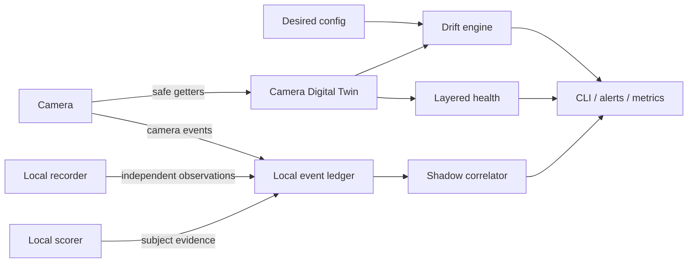

# Product roadmap: Camera Digital Twin and Shadow Detection Auditor

This roadmap moves tapo-monitor from a notification pipeline toward a local camera
reliability and detection-quality control plane. It is intentionally capability-driven:
camera models and firmware expose different methods, so an empty or unsupported response
is evidence about that device, not a reason to guess.

## Product outcome

Two connected systems form the target architecture:

The Digital Twin answers whether each camera is correctly configured and whether its
network, API, event, RTSP and storage layers are useful. The Shadow Auditor answers how
well the camera detects reality by comparing camera events with independent local
observations.

## Safety and privacy boundaries

- Read-only introspection is the default. Capability probes use verified pytapo getters on
  the daemon's existing session; they never create a second login loop.
- Raw bulk `performRequest` probing is outside production scope. Historical experiments
  showed that unsafe module enumeration can make a local camera API unavailable.
- Empty getter results mean `unknown` or `unsupported`, not a fault and never an invitation
  to enable a feature automatically.
- The event ledger stores normalized timestamps, sources, event types, decisions and
  confidence values. It stores no frames, credentials, device IDs, MAC addresses or face
  IDs.
- Camera mutations remain explicit policy. Future self-healing must be allow-listed,
  auditable and bounded; calibration, firmware upgrades and destructive storage actions
  are never automatic.
- All interpretations are model/firmware scoped. Unknown event bits are not promoted to a
  public meaning without repeatable ground truth.

## Phase 1 — Camera Digital Twin foundation

Status: **complete**

- [x] Build a redacted, JSON-serializable snapshot from safe camera getters.
- [x] Record each probe as `available`, `unknown` or `error`; normalize missing methods to
  non-alerting `unsupported` where desired state is evaluated.
- [x] Derive independent health layers: network, local API, events, RTSP and storage.
- [x] Compare normalized actual state with desired configuration using stable drift keys.
- [x] Persist the latest fleet snapshot atomically on local disk.
- [x] Persist a bounded transition history alongside the latest state and
  alert-deduplication keys.
- [x] Add read-only human and JSON CLI output for fleet status.
- [x] Add a one-shot explicit camera probe; it must be clearly separate from the daemon so
  an operator knowingly accepts the additional authenticated session.
- [x] Deduplicate drift alerts and send only new/recovered transitions when opted in.

Acceptance criteria:

- a camera can be `network=ok` while `rtsp=down` or `events=degraded`;
- a disabled detector or changed tracking mode is visible before it causes a missed alert;
- unsupported firmware methods do not create false alarms;
- the periodic probe reuses an already-connected client and cannot increase login rate.

## Phase 2 — Shadow Detection Auditor foundation

Status: **complete**; the independent worker that feeds it is Phase 3.

- [x] Create a local SQLite ledger with deterministic schema initialization and retention.
- [x] Ingest camera events and their send/drop/scorer decisions from the existing audit
  stream through a bounded background queue.
- [x] Accept independent `shadow` observations from a recorder/scorer worker or CLI.
- [x] Correlate camera and shadow observations within a configurable time window without
  pairing an observation twice.
- [x] Report matched, camera-only and shadow-only observations plus precision/recall-like
  indicators.
- [x] Expose machine-readable and operator-friendly reports without raw media.

Acceptance criteria:

- every reported count can be traced to ledger rows;
- matching is deterministic for overlapping event windows;
- `shadow_only` is clearly labelled as a review candidate, not automatically declared a
  camera miss;
- retention cleanup is bounded and does not block the live alert path.

## Phase 3 — Independent shadow worker

Status: **v1 shipped** (single-recorder-host batch; see docs/operations.md)

- [x] Read new local-recorder segments without depending on a camera event trigger.
- [x] Use coarse motion/change detection to avoid scoring every frame.
- [x] Run the local scorer on selected frames and write normalized shadow observations.
- [x] Keep all media local and store only evidence references with a short expiry when an
  operator explicitly enables review artifacts.
- [x] Produce daily per-camera miss candidates and scorer calibration datasets.

The first rollout is observation-only. It must not change thresholds automatically.

## Phase 4 — Closed-loop reliability

Status: **core v1 shipped; optional exporters remain planned**

- [x] Add allow-listed self-healing for configuration drift already asserted safely by the
  daemon (person detection, vehicle detection and SmartTrack categories).
- [x] Keep repairs bounded by policy and verify the final auto-track state after the
  allow-listed mutation path.
- [x] Add storage health based on recording continuity and freshness, not free-space
  percentage alone (loop recording normally keeps cards nearly full).
- [x] Collect bounded, secret-free latency aggregates for snapshot, scorer, Telegram and
  SD/recording follow-up operations in the durable Digital Twin state.
- [ ] Add a standalone JSON status endpoint and optional Prometheus/MQTT export.

The remaining exporter item is operationally optional: the CLI, twin state and scorer
`/health`/`/metrics` endpoints already provide machine-readable status without opening a
new network listener in the camera daemon.

## Phase 5 — Multi-camera scene intelligence

Status: **pilot v1 deployed (2026-08-25)**

- [x] Implement the existing coordinator group with a bounded event-time window.
- [x] Suppress duplicate live, sampler and SD notifications after a successful delivery.
- [x] Persist the per-camera event watermark after each detection pass to prevent replay
  after a daemon restart.
- [ ] Correlate adjacent-camera observations into a durable scene event.
- [ ] Preserve lead/follow camera pairs with event-time delta and derive a probable
  transition direction only after camera-clock alignment; never infer biometric identity.
- [ ] Select the best frame across cameras.
- Give PTZ handoffs a bounded lease and always restore the previous control policy.

The first slice is deliberately limited to configured camera groups. It leaves camera
motion untouched, does not use `handoff_preset`, shares one gate across live/sampler/SD
delivery paths, and persists the event watermark after each detection pass. The first
production pilot uses two cameras with overlapping views.

## Research tracks

These stay separate from production until repeatable evidence exists:

1. Correlate unknown `events_1` bits with camera configuration, local scorer evidence and
   deliberate ground-truth triggers.
2. Evaluate ONVIF PullPoint as an event source. The transport works, but tested firmware
   has often emitted initialization messages without reliable state changes.
3. Read light/luma/Smart-AE capabilities and measure whether exposure profiles improve
   subject sharpness before allowing adaptive writes.
4. Explore privacy-preserving known/unknown-face alert policy using local mappings; do not
   store biometric artifacts in the ledger.
5. Extend the capability manifest across camera models and firmware versions to replace
   model assumptions with adapters selected from observed support.

## Delivery sequence for contributors

Each phase should land as a separately testable work item:

1. pure data model and redaction;
2. storage and deterministic algorithms;
3. daemon integration behind an opt-in flag;
4. CLI/reporting;
5. documentation and sanitized examples;
6. observe-only production trial;
7. explicit promotion of proven policies.

Before a public commit, run `pytest -q`, `ruff check .`, the repository anonymization
scan, and review every staged path. Deployment-specific observations belong outside the
public documentation.
