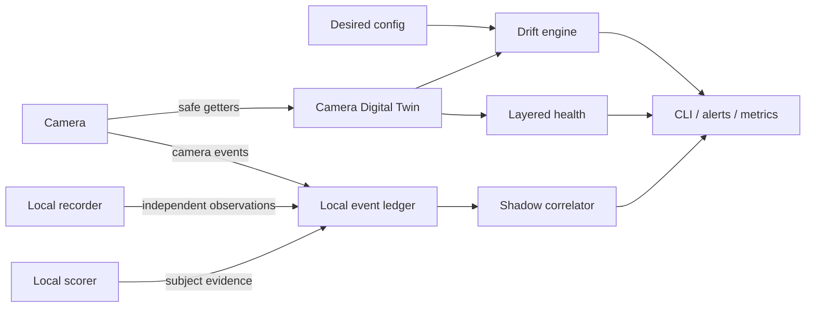

# Product roadmap: Camera Digital Twin and Shadow Detection Auditor

This roadmap moves tapo-monitor from a notification pipeline toward a local camera
reliability and detection-quality control plane. It is intentionally capability-driven:
camera models and firmware expose different methods, so an empty or unsupported response
is evidence about that device, not a reason to guess.

## Product outcome

Two connected systems form the target architecture:

The Digital Twin answers whether each camera is correctly configured and whether its
network, API, event, RTSP and storage layers are useful. The Shadow Auditor answers how
well the camera detects reality by comparing camera events with independent local
observations.

## Safety and privacy boundaries

- Read-only introspection is the default. Capability probes use verified pytapo getters on
  the daemon's existing session; they never create a second login loop.
- Raw bulk `performRequest` probing is outside production scope. Historical experiments
  showed that unsafe module enumeration can make a local camera API unavailable.
- Empty getter results mean `unknown` or `unsupported`, not a fault and never an invitation
  to enable a feature automatically.
- The event ledger stores normalized timestamps, sources, event types, decisions and
  confidence values. It stores no frames, credentials, device IDs, MAC addresses or face
  IDs.
- Camera mutations remain explicit policy. Future self-healing must be allow-listed,
  auditable and bounded; calibration, firmware upgrades and destructive storage actions
  are never automatic.
- All interpretations are model/firmware scoped. Unknown event bits are not promoted to a
  public meaning without repeatable ground truth.

## Phase 1 — Camera Digital Twin foundation

Status: **complete**

- [x] Build a redacted, JSON-serializable snapshot from safe camera getters.
- [x] Record each probe as `available`, `unknown` or `error`; normalize missing methods to
  non-alerting `unsupported` where desired state is evaluated.
- [x] Derive independent health layers: network, local API, events, RTSP and storage.
- [x] Compare normalized actual state with desired configuration using stable drift keys.
- [x] Persist the latest fleet snapshot atomically on local disk.
- [x] Persist a bounded transition history alongside the latest state and
  alert-deduplication keys.
- [x] Add read-only human and JSON CLI output for fleet status.
- [x] Add a one-shot explicit camera probe; it must be clearly separate from the daemon so
  an operator knowingly accepts the additional authenticated session.
- [x] Deduplicate drift alerts and send only new/recovered transitions when opted in.

Acceptance criteria:

- a camera can be `network=ok` while `rtsp=down` or `events=degraded`;
- a disabled detector or changed tracking mode is visible before it causes a missed alert;
- unsupported firmware methods do not create false alarms;
- the periodic probe reuses an already-connected client and cannot increase login rate.

## Phase 2 — Shadow Detection Auditor foundation

Status: **complete**; the independent worker that feeds it is Phase 3.

- [x] Create a local SQLite ledger with deterministic schema initialization and retention.
- [x] Ingest camera events and their send/drop/scorer decisions from the existing audit
  stream through a bounded background queue.
- [x] Accept independent `shadow` observations from a recorder/scorer worker or CLI.
- [x] Correlate camera and shadow observations within a configurable time window without
  pairing an observation twice.
- [x] Report matched, camera-only and shadow-only observations plus precision/recall-like
  indicators.
- [x] Expose machine-readable and operator-friendly reports without raw media.

Acceptance criteria:

- every reported count can be traced to ledger rows;
- matching is deterministic for overlapping event windows;
- `shadow_only` is clearly labelled as a review candidate, not automatically declared a
  camera miss;
- retention cleanup is bounded and does not block the live alert path.

## Phase 3 — Independent shadow worker

Status: **v1 shipped** (single-recorder-host batch; see docs/operations.md)

- [x] Read new local-recorder segments without depending on a camera event trigger.
- [x] Use coarse motion/change detection to avoid scoring every frame.
- [x] Run the local scorer on selected frames and write normalized shadow observations.
- [x] Keep all media local and store only evidence references with a short expiry when an
  operator explicitly enables review artifacts.
- [x] Produce daily per-camera miss candidates and scorer calibration datasets.
- [x] Analyse keyframes only. Scene changes live between keyframes, so decoding every
  frame of a 4K HEVC segment bought nothing and could not finish a quiet segment inside
  its timeout; the pass was killed and the segment fell back to two seek frames.
- [x] Split the decode and scoring budgets as even shares per camera, with unspent share
  rolling forward. Cameras are processed sequentially, so one run-wide counter left
  whoever was last in the config with the leftovers: on the first production night the
  second camera scanned a quarter of its day.

The first rollout is observation-only. It must not change thresholds automatically.

Open follow-up: extraction cost, not scoring, is the binding constraint, and it is
host-specific. Size the decode budget from a measurement through the extraction function
on the target host — bare ffmpeg timing understates it, because extraction also pays for
the uniform mid-segment frame and competes with the live pipeline.

## Phase 4 — Closed-loop reliability

Status: **complete** (the Prometheus/MQTT half of the exporter item was resolved by
decision, not code — see the item)

- [x] Add allow-listed self-healing for configuration drift already asserted safely by the
  daemon (person detection, vehicle detection and SmartTrack categories).
- [x] Keep repairs bounded by policy and verify the final auto-track state after the
  allow-listed mutation path.
- [x] Add storage health based on recording continuity and freshness, not free-space
  percentage alone (loop recording normally keeps cards nearly full).
- [x] Collect bounded, secret-free latency aggregates for snapshot, scorer, Telegram and
  SD/recording follow-up operations in the durable Digital Twin state.
- [x] Report a refused repair instead of swallowing it. The repairs are idempotent
  re-assertions sent every control pass, so the useful signal is not how often they ran
  but whether a camera is rejecting them — a camera with person detection stuck off
  demotes every person to bare motion. Refusals are logged and counted per repair.
- [x] Say once a day that the fleet is alive. Every other notification is a transition, so
  "everything works" was expressed as silence — indistinguishable from a dead host, a hung
  daemon or an expired bot token. The daily digest carries camera reachability, the
  daemon's tick, the shared scorer, recorder freshness, the day's delivered alert counts
  and any refused repair. It claims OK only for what it checked, and any failed check
  removes the headline: a heartbeat that says OK while a camera is down converts a silence
  you might question into a confirmation you will trust.
- [x] Add a standalone JSON status endpoint. Opt-in (`observability.status_port`), bound
  to localhost by default on purpose. Prometheus/MQTT export was decided against: the CLI,
  twin state and the scorer's endpoints already provide machine-readable status, and a new
  wide network listener does not earn its place.
- [x] Close the one gap a self-reported heartbeat cannot: a host cannot report that it is
  dead, and nobody notices an absent message. `host_watch` lets the hosts watch each other
  over the private network with the Telegram credentials they already have — consecutive
  misses to alert, one alert per cooldown, a recovery message — and can poll a peer's HTTP
  health endpoint, so the shared scorer's death is noticed from another machine.
- [x] Make the repair policy consistent: `auto_fix` and `allowed_repairs` took effect even
  when `reliability.enabled` was false, so trimming the allow-list silently disabled
  repairs that guard known regressions (person detection off, auto-track without the
  people-only filter). Decided: a disabled reliability block is inert — the guard repairs
  run as they always had, and the two keys constrain them only while the block is enabled.
- [x] Rotate the metrics journal on size as well as age, so a burst cannot outgrow a disk
  between two age checks. Size rotation never touches the state sidecar, so cumulative
  counters still survive restarts.
- [x] Sanitise addresses in the ledger at the sanitiser, not only at each caller: the
  sensitive-value pattern now covers IPv4 and session-token shapes as defence in depth.

The exporter question is settled: the JSON status endpoint stays localhost-first and
opt-in, and no Prometheus/MQTT listener ships while the CLI, twin state and scorer
endpoints already answer the same questions.

## Phase 5 — Multi-camera scene intelligence

Status: **pilot v1 deployed (2026-08-25)**

- [x] Implement the existing coordinator group with a bounded event-time window.
- [x] Suppress duplicate live, sampler and SD notifications after a successful delivery.
- [x] Persist the per-camera event watermark after each detection pass to prevent replay
  after a daemon restart.
- [ ] Correlate adjacent-camera observations into a durable scene event.
- [ ] Preserve lead/follow camera pairs with event-time delta and derive a probable
  transition direction only after camera-clock alignment; never infer biometric identity.
- [ ] Select the best frame across cameras.
- [ ] Measure and report each camera's clock offset. The duplicate gate compares event
  times across cameras, so a skew larger than the window makes it silently inert — and any
  later lead/follow inference would be worse than inert. First production evidence: on the
  pilot pair the suppressed events' start times differed by one to two seconds, so the gate
  is genuinely deciding rather than inert. That is an observation, not the reported metric
  this item asks for.
- [ ] Re-measure the gate's reach whenever a new delivery path appears. The gate is shared
  across live, sampler and follow-up paths, so giving below-threshold motion a recorder
  look multiplied its firing rate roughly sevenfold on the pilot pair — the same policy,
  a much larger effect, and no config change to point at.
- [x] Decide the preset policy for `role: static`. Decided: such a camera is parked at its
  `day_preset` and the recall is re-sent every control tick, around the clock. It is the
  camera class nothing else ever moves, so the recall is its only automatic way back from a
  nudge — and it costs nothing while the camera already holds the preset. `night_preset` is
  unused for a static camera and now draws the startup warning instead.
- Give PTZ handoffs a bounded lease and always restore the previous control policy.

The first slice is deliberately limited to configured camera groups. It leaves camera
motion untouched, does not use `handoff_preset`, shares one gate across live/sampler/SD
delivery paths, and persists the event watermark after each detection pass. The first
production pilot uses two cameras with overlapping views.

## Phase 6 — Deployment and fleet integrity

Status: **shipped; the unknown-key hard fail remains**

Deployed hosts were rsync copies of the package, not git checkouts, and a partial copy
twice produced a daemon that ran for hours while alerting on nothing. The work here made
a deploy verifiable rather than hopeful; the monitor fleet now runs from release
directories switched by a symlink. A host whose unit cannot be edited without privileges
gets the same layout by replacing the loose package directory with a symlink into
`current/` — the unit keeps its old working directory and imports the release through it,
so the canonical unit edit becomes cosmetic rather than blocking.

- [x] `tapo-monitor version`: release plus a fingerprint over the deployed module set, so a
  host can state which code it runs and a half-copied package differs visibly from its source.
- [x] `tapo-monitor selfcheck`: imports every module, loads the config, asserts the
  credential env vars that config names are set, and finds `ffmpeg`.
- [x] `tools/check_monitor_rollout.sh` and `tools/check_scorer_rollout.sh`: post-restart
  verification for both sides, including a unit in `auto-restart` that `is-active` hides.
- [x] `OnFailure` plus a start limit on both units, so a crash loop reports itself instead
  of retrying forever in silence. (Recorded as done before it was true everywhere: one
  host was missed and stayed silent for a further day. Verify a fleet-wide claim on every
  host, not on the hosts that were convenient to reach.)
- [x] Test every Python version the fleet runs, not one. A single-version matrix let a
  change ship green and break the hosts on the other version, with the deploy already done.
- [x] Install the optional extras CI needs to collect the whole suite. A module guarded by
  `pytest.importorskip` disappears silently when its dependency is absent, so the scorer
  service's tests had never run in CI while the build reported success; a step now asserts
  that module is collected rather than skipped.
- [x] One deploy path: full-package transfer into a timestamped release directory, a
  `selfcheck` inside it, then an atomic symlink switch and a per-host restart. Rollback
  becomes re-pointing the symlink instead of finding the right tarball. The unit starts
  from an absolute interpreter through the new `__main__` entry point; the whole monitor
  fleet has been migrated per the runbook in docs/operations.md and runs this layout.
- [x] Snapshot each host's config and env file into the release directory it belongs to,
  so a rollback can restore the configuration that matched that code.
- [x] Warn on unknown configuration keys. A mistyped key silently took its default, and a
  dropped `rotate` costs roughly a third of the person score — a silent alert killer. The
  warning carries the full key path plus the closest real key, derived from the dataclasses
  so the check cannot rot.
- [ ] Promote the unknown-key warning to a hard fail. Deliberately waiting until the
  warnings have soaked in production.
- [x] Nightly fleet-drift report: the daily digest's fleet block carries the running
  package fingerprint, and when `TAPO_EXPECTED_FINGERPRINT` names the intended release a
  mismatch is a failed check that removes the OK headline. Manual inventory found exactly
  this drift twice after a change had already shipped.
- [x] The repository's unit templates match a real host. The monitor template describes
  the release layout the fleet runs; the shared scorer — the last host that existed only
  on its own disk — is now built by `tools/provision_scorer.sh`, which renders
  `systemd/tapo-scorer.service.in` with that host's user, working directory and
  interpreter. Rendering rather than copying is forced by systemd: `${VAR}` expands in an
  `ExecStart` argument but never in the executable, so a copied unit needs a hand-edit on
  every host, and a hand-edit is how the running unit drifted from the repository's copy.
  The script is idempotent and installs only what differs, so it is safe to re-run against
  the live service; `--bootstrap` builds the venv on a fresh host.
- [x] Failure notification on the scorer host. It is the single point of failure for every
  camera's alerts and was the only host with no Telegram credentials, so its crash loop was
  the one that could not report itself. The unit now stops after five starts in five
  minutes rather than looping in silence, and `OnFailure=` sends the reason through the
  fleet's own notifier. Together with the mutual host watch polling `/health` from another
  machine, a dead scorer is now noticed both from outside and from within.

## Research tracks

These stay separate from production until repeatable evidence exists:

1. Correlate unknown `events_1` bits with camera configuration, local scorer evidence and
   deliberate ground-truth triggers.
2. Evaluate ONVIF PullPoint as an event source. The transport works, but tested firmware
   has often emitted initialization messages without reliable state changes.
3. Read light/luma/Smart-AE capabilities and measure whether exposure profiles improve
   subject sharpness before allowing adaptive writes.
4. Explore privacy-preserving known/unknown-face alert policy using local mappings; do not
   store biometric artifacts in the ledger.
5. Extend the capability manifest across camera models and firmware versions to replace
   model assumptions with adapters selected from observed support.

## Delivery sequence for contributors

Each phase should land as a separately testable work item:

1. pure data model and redaction;
2. storage and deterministic algorithms;
3. daemon integration behind an opt-in flag;
4. CLI/reporting;
5. documentation and sanitized examples;
6. observe-only production trial;
7. explicit promotion of proven policies.

Before a public commit, run `pytest -q`, `ruff check .`, the repository anonymization
scan, and review every staged path. Deployment-specific observations belong outside the
public documentation.
