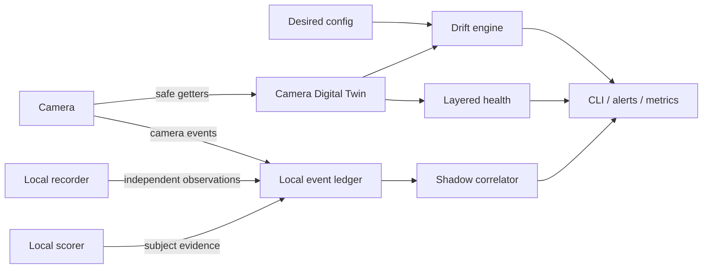

# Product roadmap: Camera Digital Twin and Shadow Detection Auditor

This roadmap moves tapo-monitor from a notification pipeline toward a local camera
reliability and detection-quality control plane. It is intentionally capability-driven:
camera models and firmware expose different methods, so an empty or unsupported response
is evidence about that device, not a reason to guess.

## Product outcome

Two connected systems form the target architecture:

The Digital Twin answers whether each camera is correctly configured and whether its
network, API, event, RTSP and storage layers are useful. The Shadow Auditor answers how
well the camera detects reality by comparing camera events with independent local
observations.

## Safety and privacy boundaries

- Read-only introspection is the default. Capability probes use verified pytapo getters on
  the daemon's existing session; they never create a second login loop.
- Raw bulk `performRequest` probing is outside production scope. Historical experiments
  showed that unsafe module enumeration can make a local camera API unavailable.
- Empty getter results mean `unknown` or `unsupported`, not a fault and never an invitation
  to enable a feature automatically.
- The event ledger stores normalized timestamps, sources, event types, decisions and
  confidence values. It stores no frames, credentials, device IDs, MAC addresses or face
  IDs.
- Camera mutations remain explicit policy. Future self-healing must be allow-listed,
  auditable and bounded; calibration, firmware upgrades and destructive storage actions
  are never automatic.
- All interpretations are model/firmware scoped. Unknown event bits are not promoted to a
  public meaning without repeatable ground truth.

## Phase 1 — Camera Digital Twin foundation

Status: **complete**

- [x] Build a redacted, JSON-serializable snapshot from safe camera getters.
- [x] Record each probe as `available`, `unknown` or `error`; normalize missing methods to
  non-alerting `unsupported` where desired state is evaluated.
- [x] Derive independent health layers: network, local API, events, RTSP and storage.
- [x] Compare normalized actual state with desired configuration using stable drift keys.
- [x] Persist the latest fleet snapshot atomically on local disk.
- [x] Persist a bounded transition history alongside the latest state and
  alert-deduplication keys.
- [x] Add read-only human and JSON CLI output for fleet status.
- [x] Add a one-shot explicit camera probe; it must be clearly separate from the daemon so
  an operator knowingly accepts the additional authenticated session.
- [x] Deduplicate drift alerts and send only new/recovered transitions when opted in.

Acceptance criteria:

- a camera can be `network=ok` while `rtsp=down` or `events=degraded`;
- a disabled detector or changed tracking mode is visible before it causes a missed alert;
- unsupported firmware methods do not create false alarms;
- the periodic probe reuses an already-connected client and cannot increase login rate.

## Phase 2 — Shadow Detection Auditor foundation

Status: **complete**; the independent worker that feeds it is Phase 3.

- [x] Create a local SQLite ledger with deterministic schema initialization and retention.
- [x] Ingest camera events and their send/drop/scorer decisions from the existing audit
  stream through a bounded background queue.
- [x] Accept independent `shadow` observations from a recorder/scorer worker or CLI.
- [x] Correlate camera and shadow observations within a configurable time window without
  pairing an observation twice.
- [x] Report matched, camera-only and shadow-only observations plus precision/recall-like
  indicators.
- [x] Expose machine-readable and operator-friendly reports without raw media.

Acceptance criteria:

- every reported count can be traced to ledger rows;
- matching is deterministic for overlapping event windows;
- `shadow_only` is clearly labelled as a review candidate, not automatically declared a
  camera miss;
- retention cleanup is bounded and does not block the live alert path.

## Phase 3 — Independent shadow worker

Status: **v1 shipped** (single-recorder-host batch; see docs/operations.md)

- [x] Read new local-recorder segments without depending on a camera event trigger.
- [x] Use coarse motion/change detection to avoid scoring every frame.
- [x] Run the local scorer on selected frames and write normalized shadow observations.
- [x] Keep all media local and store only evidence references with a short expiry when an
  operator explicitly enables review artifacts.
- [x] Produce daily per-camera miss candidates and scorer calibration datasets.
- [x] Analyse keyframes only. Scene changes live between keyframes, so decoding every
  frame of a 4K HEVC segment bought nothing and could not finish a quiet segment inside
  its timeout; the pass was killed and the segment fell back to two seek frames.
- [x] Split the decode and scoring budgets as even shares per camera, with unspent share
  rolling forward. Cameras are processed sequentially, so one run-wide counter left
  whoever was last in the config with the leftovers: on the first production night the
  second camera scanned a quarter of its day.

The first rollout is observation-only. It must not change thresholds automatically.

Open follow-up: extraction cost, not scoring, is the binding constraint, and it is
host-specific. Size the decode budget from a measurement through the extraction function
on the target host — bare ffmpeg timing understates it, because extraction also pays for
the uniform mid-segment frame and competes with the live pipeline.

## Phase 4 — Closed-loop reliability

Status: **complete** (the Prometheus/MQTT half of the exporter item was resolved by
decision, not code — see the item)

- [x] Add allow-listed self-healing for configuration drift already asserted safely by the
  daemon (person detection, vehicle detection and SmartTrack categories).
- [x] Keep repairs bounded by policy and verify the final auto-track state after the
  allow-listed mutation path.
- [x] Add storage health based on recording continuity and freshness, not free-space
  percentage alone (loop recording normally keeps cards nearly full).
- [x] Collect bounded, secret-free latency aggregates for snapshot, scorer, Telegram and
  SD/recording follow-up operations in the durable Digital Twin state.
- [x] Report a refused repair instead of swallowing it. The repairs are idempotent
  re-assertions sent every control pass, so the useful signal is not how often they ran
  but whether a camera is rejecting them — a camera with person detection stuck off
  demotes every person to bare motion. Refusals are logged and counted per repair.
- [x] Say once a day that the fleet is alive. Every other notification is a transition, so
  "everything works" was expressed as silence — indistinguishable from a dead host, a hung
  daemon or an expired bot token. The daily digest carries camera reachability, the
  daemon's tick, the shared scorer, recorder freshness, the day's delivered alert counts
  and any refused repair. It claims OK only for what it checked, and any failed check
  removes the headline: a heartbeat that says OK while a camera is down converts a silence
  you might question into a confirmation you will trust.
- [x] Add a standalone JSON status endpoint. Opt-in (`observability.status_port`), bound
  to localhost by default on purpose. Prometheus/MQTT export was decided against: the CLI,
  twin state and the scorer's endpoints already provide machine-readable status, and a new
  wide network listener does not earn its place.
- [x] Close the one gap a self-reported heartbeat cannot: a host cannot report that it is
  dead, and nobody notices an absent message. `host_watch` lets the hosts watch each other
  over the private network with the Telegram credentials they already have — consecutive
  misses to alert, one alert per cooldown, a recovery message — and can poll a peer's HTTP
  health endpoint, so the shared scorer's death is noticed from another machine.
- [x] Make the repair policy consistent: `auto_fix` and `allowed_repairs` took effect even
  when `reliability.enabled` was false, so trimming the allow-list silently disabled
  repairs that guard known regressions (person detection off, auto-track without the
  people-only filter). Decided: a disabled reliability block is inert — the guard repairs
  run as they always had, and the two keys constrain them only while the block is enabled.
- [x] Rotate the metrics journal on size as well as age, so a burst cannot outgrow a disk
  between two age checks. Size rotation never touches the state sidecar, so cumulative
  counters still survive restarts.
- [x] Sanitise addresses in the ledger at the sanitiser, not only at each caller: the
  sensitive-value pattern now covers IPv4 and session-token shapes as defence in depth.

The exporter question is settled: the JSON status endpoint stays localhost-first and
opt-in, and no Prometheus/MQTT listener ships while the CLI, twin state and scorer
endpoints already answer the same questions.

## Phase 5 — Multi-camera scene intelligence

Status: **pilot v1 deployed (2026-08-25)**

- [x] Implement the existing coordinator group with a bounded event-time window.
- [x] Suppress duplicate live, sampler and SD notifications after a successful delivery.
- [x] Persist the per-camera event watermark after each detection pass to prevent replay
  after a daemon restart.
- [x] Correlate adjacent-camera observations into a durable scene event (offline-capable ledger path; live pair still required for production validation).
- [x] Preserve lead/follow camera pairs with event-time delta and an explicit measured camera order;
  direction remains unknown until that order is supplied. Clock-offset calibration remains open; never infer biometric identity.
- [x] Select the best frame across cameras.
- [x] Acquire a hub-backed test pair (compatible hub plus battery camera) for validation.
  Hub storage and indexed clips let the `hubpoll` path and the 24/7-recording guard be
  tested end to end against real hardware.
- [x] Measure and report each camera's clock offset. The duplicate gate compares event
  times across cameras, so a skew larger than the window makes it silently inert — and any
  later lead/follow inference would be worse than inert. Clock readings are sampled from
  the digital twin probe, tracked via `SceneCoordinator.clock_offset`, evaluated in drift,
  and reported in the daily fleet health digest when skew exceeds tolerance.
- [ ] Re-measure the gate's reach whenever a new delivery path appears. The gate is shared
  across live, sampler and follow-up paths, so giving below-threshold motion a recorder
  look multiplied its firing rate roughly sevenfold on the pilot pair — the same policy,
  a much larger effect, and no config change to point at.
- [x] Decide the preset policy for `role: static`. Decided: such a camera is parked at its
  `day_preset` and the recall is re-sent every control tick, around the clock. It is the
  camera class nothing else ever moves, so the recall is its only automatic way back from a
  nudge — and it costs nothing while the camera already holds the preset. `night_preset` is
  unused for a static camera and now draws the startup warning instead.
- [x] Model PTZ handoffs as a bounded lease with deterministic expiry and previous-policy restoration; live camera movement remains gated until a measured overlapping pair is available.

The first slice is deliberately limited to configured camera groups. It leaves camera
motion untouched, does not use `handoff_preset`, shares one gate across live/sampler/SD
delivery paths, and persists the event watermark after each detection pass. Live multi-camera
PTZ handoffs are staged for future deployment when a second overlapping camera is added to the site.

## Phase 6 — Deployment and fleet integrity

Status: **shipped**

Deployed hosts were rsync copies of the package, not git checkouts, and a partial copy
twice produced a daemon that ran for hours while alerting on nothing. The work here made
a deploy verifiable rather than hopeful; the monitor fleet now runs from release
directories switched by a symlink. A host whose unit cannot be edited without privileges
gets the same layout by replacing the loose package directory with a symlink into
`current/` — the unit keeps its old working directory and imports the release through it,
so the canonical unit edit becomes cosmetic rather than blocking.

- [x] `tapo-monitor version`: release plus a fingerprint over the deployed module set, so a
  host can state which code it runs and a half-copied package differs visibly from its source.
- [x] `tapo-monitor selfcheck`: imports every module, loads the config, asserts the
  credential env vars that config names are set, and finds `ffmpeg`.
- [x] `tools/check_monitor_rollout.sh` and `tools/check_scorer_rollout.sh`: post-restart
  verification for both sides, including a unit in `auto-restart` that `is-active` hides.
- [x] `OnFailure` plus a start limit on both units, so a crash loop reports itself instead
  of retrying forever in silence. (Recorded as done before it was true everywhere: one
  host was missed and stayed silent for a further day. Verify a fleet-wide claim on every
  host, not on the hosts that were convenient to reach.)
- [x] Test every Python version the fleet runs, not one. A single-version matrix let a
  change ship green and break the hosts on the other version, with the deploy already done.
- [x] Install the optional extras CI needs to collect the whole suite. A module guarded by
  `pytest.importorskip` disappears silently when its dependency is absent, so the scorer
  service's tests had never run in CI while the build reported success; a step now asserts
  that module is collected rather than skipped.
- [x] One deploy path: full-package transfer into a timestamped release directory, a
  `selfcheck` inside it, then an atomic symlink switch and a per-host restart. Rollback
  becomes re-pointing the symlink instead of finding the right tarball. The unit starts
  from an absolute interpreter through the new `__main__` entry point; the whole monitor
  fleet has been migrated per the runbook in docs/operations.md and runs this layout.
- [x] Snapshot each host's config and env file into the release directory it belongs to,
  so a rollback can restore the configuration that matched that code.
- [x] Reject unknown configuration keys before startup. A mistyped key now fails with the
  full path and closest real key, derived from dataclasses so the check cannot rot.
- [x] Nightly fleet-drift report: the daily digest's fleet block carries the running
  package fingerprint, and when `TAPO_EXPECTED_FINGERPRINT` names the intended release a
  mismatch is a failed check that removes the OK headline. Manual inventory found exactly
  this drift twice after a change had already shipped.
- [x] The repository's unit templates match a real host. The monitor template describes
  the release layout the fleet runs; the shared scorer — the last host that existed only
  on its own disk — is now built by `tools/provision_scorer.sh`, which renders
  `systemd/tapo-scorer.service.in` with that host's user, working directory and
  interpreter. Rendering rather than copying is forced by systemd: `${VAR}` expands in an
  `ExecStart` argument but never in the executable, so a copied unit needs a hand-edit on
  every host, and a hand-edit is how the running unit drifted from the repository's copy.
  The script is idempotent and installs only what differs, so it is safe to re-run against
  the live service; `--bootstrap` builds the venv on a fresh host.
- [x] Failure notification on the scorer host. It is the single point of failure for every
  camera's alerts and was the only host with no Telegram credentials, so its crash loop was
  the one that could not report itself. The unit now stops after five starts in five
  minutes rather than looping in silence, and `OnFailure=` sends the reason through the
  fleet's own notifier. Together with the mutual host watch polling `/health` from another
  machine, a dead scorer is now noticed both from outside and from within.

## Phase 7 — Runtime correctness and deterministic behaviour

Status: **complete** (not yet deployed)

A gap review against a generic "autonomous PTZ platform" wish list found that most of
it already exists here (digital twin, drift, self-healing, clock offsets, host watch,
release deploys) or was decided against (see *Considered and declined* below). What
remained were a few concrete defects in how the daemon moves cameras, what it forgets on
restart and how it stops. Each stage lands as one reviewed, tested commit; deployment is
a separate decision.

### 7.1 — One owner for the motor

Two paths move a lens and neither knows about the other: the control pass recalls the
day/night preset through pytapo every `control_interval`, and the pan-limit guard sends
ONVIF `GotoPreset` every `pan_limit.poll_interval`.

- [x] Introduce a small motion arbiter (`tapo_monitor/motion.py`) with an explicit priority order —
  privacy/parked > auto-track hold > pan-limit guard > scheduled preset recall — that
  both paths consult before sending a motor command. No new behaviour, only refusals.
- [x] The guard honours `track_hold` after a `pan_limit.hold_grace` (default 20 s) of
  continuous out-of-bounds. Before, it could recall a lens off a held subject, and
  `hold_rescue_recall` exists to send the frame that recall broke; the rescue stays as a
  safety net but should stop firing in the ordinary case.
- [x] The guard honours a privacy state the twin actually read. A parked lens answers
  every motor call with `MOTOR_BUSY`; the guard used to re-send every few seconds.
- [x] Log each refusal stretch once with owner, reason and camera, and count refusals per
  camera (`MonitorState.motion_refusals`), so a lens that never moves is distinguishable
  from one that is being held on purpose.
- [x] Tests: guard vs hold (grace, restart of the grace, hold expiry, no tracking,
  `hold_grace: 0`), guard vs privacy, scheduled recall refusals.

### 7.2 — Survive a restart without losing alerts

Every deploy restarts the daemon, and a restart currently drops the hub retry queue (the
only copy of those alerts), pending SD follow-ups and the alert cooldowns — the last one
means a restart mid-incident can re-send an alert that was already delivered.

- [x] Persist `pending_hub`, `pending_sd` and the cooldown state (`last_alert`,
  `last_event_start`) atomically next to the existing health state, with a schema version
  and a maximum age so a week-old queue is discarded rather than replayed.
- [x] Reload on start; entries whose media no longer exists are dropped with a log line,
  never silently.
- [x] Tests: restart with a queued hub alert delivers it once; restart inside a cooldown
  does not re-send; stale and corrupt files fall back to an empty state.

### 7.3 — Clean shutdown and thread-safe status reads

- [x] On SIGTERM/SIGINT drain the audit-ledger queue with a bounded timeout, so the last
  decisions before a restart reach SQLite.
- [x] Persist the 7.2 state on exit as well as on change.
- [x] `statusd` reads `MonitorState` from its own thread while the main loop mutates
  dicts; serve it from a snapshot published by the main loop instead of reading live
  state, so a status request can never see a half-updated dict or fail with a 500.
- [x] Check the incident-preservation worker's attempt counter. No change needed:
  `submit` returns early while the worker is alive and only touches the counter before
  starting it or after it has finished; the invariant is now written down in the code.
- [x] Defer a stop signal to the tick boundary (a second one exits at once), so a stop
  never cuts a preset recall or a Telegram send in half; bound the ledger flush that
  `logging.shutdown()` performs at exit.

### 7.4 — Scenario harness and replay

The test suite already injects every dependency; what is missing is a shared harness, so
multi-tick scenarios are written once rather than rebuilt by hand in each test.

- [x] A scenario harness: fake clock, scripted camera (events, presets, refusals,
  disconnects), fake ONVIF, recording notifier. Assert on the sequence of transitions,
  not just the final state. (`tests/scenario.py`, driving the real `loop_step`.)
- [x] Scenarios: event during hold, camera disconnect mid-alert, duplicate events, rain
  change during tracking, restart during a pending delivery, RTSP down while the API is
  alive, capability missing on the camera, restart inside a cooldown
  (`tests/test_scenarios.py`).
- [x] `tapo-monitor replay`: feed a recorded audit log/ledger window through the same
  production decision logic with media and delivery stubbed, and print the decisions it
  would take — so a policy change can be checked against a real night before it ships.
  (`tapo_monitor/replay.py`: ledger window through mute, cooldown and scene-group gates,
  `--compare` a second config, `--json`; see
  [observability](observability.md#replaying-a-night).)

### 7.5 — Incident identity

- [x] Derive an incident ID from the camera event (`<camera>-<start>`) and carry it
  through audit lines and the sent-frame index; ledger rows are found by the same
  camera and start, so detect → frame → score → delivery can be followed without
  matching timestamps. Derived rather than issued, so it needs no state and survives a
  restart. The Telegram caption is deliberately left unchanged.
- [x] `tapo-monitor incident <id>` prints that chain (`--json` for machines).

### 7.6 — Cheap configuration checks

- [x] `coordinator.camera_order` must name cameras of its own group.
- [x] A soft deprecation path: a renamed key is accepted with a warning for one release
  instead of becoming a hard error immediately.

### Considered and declined

- **Patrol routes / preset tours.** Day policy is a fixed preset, night policy is
  firmware auto-track; a patrol would fight both. Revisit only after 7.1 exists, and only
  for a camera class that is neither tracked nor static.
- **Event bus and package restructuring.** The daemon's direct pass sequence is simple and
  fully injectable; a rewrite would put a working fleet at risk for no measured gain.
- **Telegram as a command channel.** It would turn the bot token into a remote camera
  controller. Status is already available through `statusd` and the CLI.
- **Siren, vehicle tracking, Prometheus/MQTT exporter.** Decided earlier; see the
  architecture non-goals and Phase 4.
- **Generic multi-camera abstraction.** Runtime state is already keyed per camera; live
  PTZ handoff (`handoff.py`) waits for a measured overlapping pair (Phase 5).

## Phase 8 — Prove phase 7 in production, close what it exposed

Status: **in progress** (8.2–8.4 done; 8.1 trial running on one camera; 8.5 waits for a second camera)

Phase 7 was built and tested against fakes; the scenario harness and a replay of a real
recorded day then surfaced a handful of smaller gaps. This phase ships phase 7 the way
the delivery sequence prescribes — observe first, promote later — and fixes those gaps.

### 8.1 — Observe-only trial of the motion arbiter

- [ ] Deploy to the one camera that runs `track_hold` with `pan_limit` first. Compare a
  week of `hold_rescue_recall` sends, pan-limit frames and `motion_refusals` before and
  after; the arbiter is worth keeping only if the rescue stops firing in the ordinary
  case without the lens lingering out of bounds.
- [x] Carry `motion_refusals` and a "runtime state restored" count in the daily digest's
  fleet block, so the trial is read from Telegram rather than from logs (detail lines,
  never a failed check).

### 8.2 — Privacy mode seen on the pass it changes

- [x] The control pass runs before the twin probe, so the first pass after privacy goes
  on still sends a refused recall (plus its retry), and the aim is restored one twin
  probe after privacy goes off — up to `probe_interval` (default 900 s) late. Read the
  privacy switch cheaply on the control pass itself and let the twin keep reporting it.
- [x] A refused guard `GotoPreset` in that window is treated as an ONVIF failure and
  rebuilds the client every poll; count it as a refusal instead.

Done: the control pass reads `getPrivacyMode` on its connected client (fallback: the
twin) and the guard classifies a MOTOR_BUSY `GotoPreset` as a refusal; pinned by
scenarios in `tests/test_scenarios.py`.

### 8.3 — One outage, one notice

- [x] A camera that is simply offline likely also trips the event-API watchdog once
  `event_failure_threshold` passes, because `events_reachable` stays false without a
  client. Pin the behaviour with a scenario, then suppress the event-API notice while
  the network layer already reports the outage.
  Confirmed and worse than suspected: with default thresholds a 20-minute outage sent
  the event warning before the 🔴 alert, rebooted the camera the moment it returned and
  closed with "restored after 0s". The event watchdog now stands down while a network
  outage is open and restarts its clock on return.

### 8.4 — Replay beyond the live path

- [x] Replay SD follow-up and sampler decisions too; today a cooldown armed by an SD
  delivery is invisible to replay, so it over-reports `would_alert`. Recorded SD, sampler
  and hub-clip sends that reached Telegram now arm the gates in the replay timeline as
  `delivered[<path>]`; they are replayed as recorded facts, not re-decided.
- [x] Use the recorded scorer confidence in the ledger to answer threshold what-ifs
  (`--compare` with a different `scorer.threshold`), still without media. Frames that
  were never scored keep the gates-only answer.
- [x] Re-measure the scene gate's reach with replay whenever a delivery path is added
  (the open Phase 5 item), instead of by hand: `replay --summary-only --scene-reach`
  reports the alerts the gate removed per camera (see observability, "Replaying a
  night").

### 8.5 — Dual-camera handoff on the arbiter

- [ ] When the second overlapping camera is deployed, wire `HandoffManager` in as a
  motion requester (below hold, above the scheduled recall) so a handoff lease cannot
  fight tracking, the guard or privacy. Keep it observe-only until the pair's clock
  offset and camera order are measured.

## Phase 9 — Detection quality from our own labelled frames

Status: **in progress** (9.1 and 9.3's CPU teacher shipped; 9.2 tooling shipped — night
thresholds wait for the drop sample to collect night frames; 9.4 not started)

A month of ledger data from one site (20k camera events, 145k scored frames) shows the
scorer separates sharply: 77 % of events score below 0.30, 17 % above 0.65, and only
about 6 % fall in between. Moving `scorer.threshold` by ±0.1 changes a handful of alerts
a week (checked with `tapo-monitor replay`), so threshold tuning is not the lever. What
is missing is ground truth: nobody knows how many "clearly nothing" frames held a
distant or night-time person, or how many sent alerts were netting, scaffolding or
shadows. The generic detector has never seen this fleet's IR night scenes.

### 9.1 — Collect and label

- [x] `tools/collect_frames.sh`: pull every host's sent and review logs into one local
  dataset, never deleting and merging indexes, so the dataset outlives the hosts'
  retention (nightly timer on the operator's machine; host retention raised to 14 days).
- [x] `tapo-monitor label` / `label-stats`: a localhost labelling page (person / no
  person / unsure), gray zone first, then a sample of low scores (possible misses), then
  high scores (possible false alarms); append-only `labels.jsonl` keyed by image hash.
- [x] Label the first few hundred frames and publish the first real numbers. First pass
  (815 frames, 699 labelled by the teacher, 86 by hand): about 2 % of sent frames were
  false alarms, while 30 of 33 frames held back for corroboration showed a person.

### 9.2 — Calibrate from labels

- [x] First calibration from labels: on the pilot sites the corroboration hold
  (`motion_send_threshold`) was withholding mostly real people, so it was lowered, and
  one site's `scorer.threshold` moved down after a replay estimated the added volume.
  Re-check false alarms in the newly admitted score band once it has been labelled.
- [x] Split `scorer.threshold` by day and night (and per camera where labels justify it)
  using the threshold `label-stats` reports as best-separating; verify the change with
  `replay --compare` before shipping. The mechanism is in place: `scorer.night_threshold`
  per camera (applied on the camera's night, `schedule` included, by the daemon, replay and
  the shadow scan), and `label-stats --config` reports the best threshold by day and night,
  overall and per camera, flagging slices with too few labels. No site sets a night value:
  the first night slice (198 labelled frames) separates best at the same 0.31 as the day,
  although misses (3.9 % of person incidents) and false alarms (4.5 %) run about twice the
  day's rates. `label-stats --config` needs the site location (`location` in the config or
  `NIGHT_LAT`/`NIGHT_LON`/`NIGHT_TZ`), or it falls back to a fixed clock window.
- [x] Keep more of what matters: archive a sample of below-threshold frames (not only held
  ones) so possible misses keep reaching the labelling queue. Live, sampler and SD drops
  go to the review log at `TAPO_REVIEW_DROP_SAMPLE` (5 %), at most
  `TAPO_REVIEW_DROP_MAX_PER_HOUR` (6) per camera; `label-stats` reports held frames and
  dropped frames as separate miss estimates, weighting the sample by its rate.
- [ ] Re-check once the drop sample has collected a few weeks of night frames: set a
  `night_threshold` per camera only where `label-stats --config` shows a night cut that
  differs from the day's, and check it with `replay --compare` before shipping.

### 9.3 — Teacher model

- [x] `tapo-monitor autolabel`: a larger detector (YOLOX-x) scores every collected frame
  once; frames it and the production scorer agree on are labelled automatically, and the
  labelling page queues the biggest disagreements first — the most likely errors, and
  the only frames a person has to look at. Runs on the CPU of the operator's machine
  (about 2 s a frame on two threads); observe-only, nothing on the alert path changes.
- [ ] Move the teacher to the shared GPU host only when the dataset outgrows a CPU run.
- [ ] Rules for the shared host: announce every write, work in one own directory, check
  free disk and GPU use first, clean up after each run.

### 9.4 — A site-specific verifier

- [ ] Train a small person/no-person verifier on crops of the scorer's boxes from the
  labelled frames (image-level labels suffice, unlike retraining the detector), on the
  GPU host; evaluate on a held-out set per camera and day/night.
- [ ] Shadow-run it next to the production scorer for a week (scores logged, alerts
  unchanged), compare on newly labelled frames, and promote only with a measured gain.
  Rollback is switching the scorer back; the model file is versioned beside it.
- [ ] Only if the verifier plateaus: box-level labelling and fine-tuning the detector
  itself.

## Phase 10 — Incidents, not frames

Status: **in progress** (10.1 and 10.3 done; 10.2 in an observe-only trial on one camera;
10.4: the recording follow-up is shortened, the camera-card path is next)

Frame statistics hide what matters to the person holding the phone: was each visit
alerted, and how late. A first join of labels with deliveries showed that of 31 held
frames labelled `person`, 17 had no alert from the same host within three minutes, while
false alarms stay near 2–3 % of sent frames. The corroboration hold, not the scorer, is
the largest source of missed people, and only an incident-level measure can show
whether a change to it helps.

The per-incident report (10.1) confirmed it: of 719 incidents with a labelled person, 18
(2.5 %) got no delivered alert, and 17 of those had a held frame showing the person. It
also showed the next problem: the first alert of an incident arrives a median 115 s
after the camera event starts (p90 about 200 s), with a peak between 90 and 150 s on the
busiest site.

### 10.1 — Quality per incident

- [x] Every archived frame (sent log and review log, every delivery path) carries the
  incident ID and the camera event start, so frames of one visit can be grouped without
  guessing from timestamps.
- [x] `label-stats` groups labelled frames into incidents (by incident ID; older records
  without one by camera and a time gap) and reports incidents with a person, how many of
  them were alerted, missed incidents, and the delay from event start to the first
  delivered alert (median and p90), by day and night with `--config`.

### 10.2 — Do not let a held person expire

- [x] A held marginal frame whose corroboration never came is dropped as `hold_expired`
  unless a pan-limit recall broke the corroboration. Add an expiry policy for the sampler:
  send the best held frame when the hold expires and its score reaches a configured
  floor, with an `observe` mode that only audits what it would have sent.
- [x] Replay the policy from recorded `hold`/`hold_expired` ledger rows so
  `replay --compare` estimates the added alerts before a camera switches it on.
- [ ] Trial it in `observe` mode on one camera (running since 2026-09-24), label the frames
  it would have sent, and promote to `send` from incident-level numbers (10.1).

### 10.3 — Telemetry that fills disks

- [x] Report the size and file count of the sent, review and pan-limit logs in the daily
  digest's fleet block, and warn once when free space on that filesystem falls below a
  floor: 14-day retention plus the drop sample must never be what fills a host's disk.

### 10.4 — Alert latency

- [x] Record which delivery path sent each archived frame (live, sampler, SD/recording,
  hub clip, hold rescue) and report first-alert delay per path in `label-stats`, so the
  90–150 s peak is attributed to a path before anything is changed. Sent records carry
  `path`; the per-path table needs a few days of new records before it says anything,
  since older frames count as `unknown`.
- [x] Attribute the delay. Seven days of audit lines on the busiest site: the SD/recording
  follow-up sent the first alert of 306 of 507 alerted incidents, a median 119 s after the
  event (live 24 s, sampler 79 s). On a recording-source camera the window was read only
  after its whole span plus a 60 s margin, while the recorder trails the clock by 2-3 s.
- [x] Shorten the recording follow-up: a 15 s margin, and an early look at the event's first
  24 s that sends as soon as a subject is there. First sends after the change left 56-58 s
  after the event.
- [ ] Confirm on a few days of first alerts per path (median and p90 before and after).
- [ ] The early look still takes ~15 s to extract and score six frames, and the main loop
  waits for it; measure extraction against scoring, then batch the extraction or move the
  follow-up off the main loop.
- [ ] Camera-card follow-ups (a median 175-200 s on the sites that use them) stay behind
  pytapo's 60 s freshness guard plus a slow download; try a smaller first window there only
  once the recording change is confirmed.

## Research tracks

These stay separate from production until repeatable evidence exists:

1. Correlate unknown `events_1` bits with camera configuration, local scorer evidence and
   deliberate ground-truth triggers.
2. Evaluate ONVIF PullPoint as an event source. The transport works, but tested firmware
   has often emitted initialization messages without reliable state changes.
3. Read light/luma/Smart-AE capabilities and measure whether exposure profiles improve
   subject sharpness before allowing adaptive writes.
4. Explore privacy-preserving known/unknown-face alert policy using local mappings; do not
   store biometric artifacts in the ledger. (**Shipped:** `learn-face` CLI helper and
   `faces.ignore_known` filtering in `tapo_monitor`).
5. Extend the capability manifest across camera models and firmware versions to replace
   model assumptions with adapters selected from observed support.
6. Standalone battery camera onboarding (hubless protocol). (**Paused:** BLE pairing key
   extraction was inconclusive and test hub hardware is no longer available locally;
   production `hubpoll` clip ingestion remains active for existing paired setups).
7. High Light Compensation (HLC) and Overexposure Suppression for night street monitoring
   to prevent moving car headlights from blinding the optical sensor.

## Delivery sequence for contributors

Each phase should land as a separately testable work item:

1. pure data model and redaction;
2. storage and deterministic algorithms;
3. daemon integration behind an opt-in flag;
4. CLI/reporting;
5. documentation and sanitized examples;
6. observe-only production trial;
7. explicit promotion of proven policies.

Before a public commit, run `pytest -q`, `ruff check .`, the repository anonymization
scan, and review every staged path. Deployment-specific observations belong outside the
public documentation.
