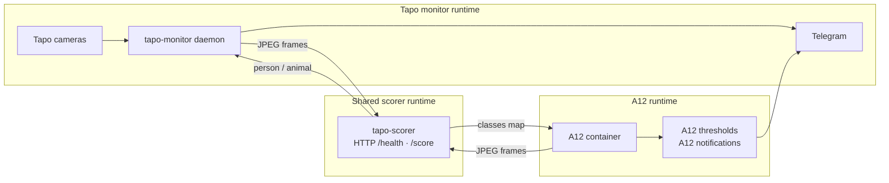

# Runtime topology

This repository provides the `tapo_monitor` Python package, but production can run more
than one process from it. Keep these roles separate when debugging or deploying.

## Process roles

| Role | Typical unit/process | Owner | Purpose | Talks to |
| --- | --- | --- | --- | --- |
| Tapo monitor daemon | `tapo-monitor run /path/cameras.yaml` | This repo | Poll Tapo events, control PTZ/day/night/rain behaviour, grab frames, decide whether to alert, send Telegram. | Tapo cameras, optional scorer, optional Groq, Telegram |
| YOLO scorer service | `python -m tapo_monitor.scorer_service --model ... --port ...` | This repo | Stateless HTTP JPEG scorer. It does not poll cameras or send Telegram. | Tapo monitor daemon, A12 |
| A12 system | Docker/container app outside this repo | A12 repo | Its own camera/audio/event pipeline. It can reuse the scorer over HTTP. | Shared scorer, Telegram through A12 |
| Local recorder | external process, optional | Deployment-specific | Continuously records RTSP. If `RECORDING_ROOT` is configured, tapo-monitor can use the newest local segment as a snapshot fallback. | Tapo monitor snapshot fallback |

The important boundary: **the scorer is shared, the alert pipelines are not**. Tapo and
A12 must not import each other's code. Their only shared contract is HTTP:

```text
POST /score  JPEG bytes -> {"person": float, "animal": float, "classes": {...}}
```

## Current deployment shape

The tested production shape is:



The scorer may run on the same host as A12 or on another machine reachable over the
network. If A12 uses Docker host networking, `http://127.0.0.1:8766/score` points at the
host scorer. Without host networking, use a host/service address reachable from inside the
container.

## Why there are multiple instances

- `tapo-monitor` is stateful per deployment: it owns camera sessions, watermarks,
  cooldowns, pending SD jobs, sampler groups and Telegram sends.
- `tapo-scorer` is stateless and intentionally shareable: one stronger machine can score
  frames for several Pi monitors and for A12.
- A12 is a separate product/runtime. It only reuses the scorer so both systems see the
  same model output; it keeps its own thresholds and notification rules.
- A local recorder, when present, is not an alerting service. It is only a best-effort
  frame source when live RTSP capture fails.

## Tapo monitor instance

The monitor daemon is configured by one `cameras.yaml`. That single daemon can manage
multiple cameras. Use another daemon instance only when the cameras live on a different
host/network or you deliberately want isolated state and restart boundaries.

Runtime state owned by one daemon instance:

- `last_seen` event watermarks
- per-camera alert cooldowns
- camera-down watchdog state
- pending SD follow-up queue
- sampler groups across long events
- weather/day-night control decisions

Operational commands:

```bash
tapo-monitor check /etc/tapo-monitor/cameras.yaml
tapo-monitor run /etc/tapo-monitor/cameras.yaml
journalctl -u tapo-monitor --since "24 hours ago" --no-pager
```

Deployment and health checks are kept in [`deployment-health.md`](deployment-health.md).

## Shared scorer instance

The scorer service only accepts frames and returns scores. It does not know camera names,
Telegram chats, cooldowns or whether the caller is Tapo or A12.

Example:

```bash
python -m tapo_monitor.scorer_service \
  --model /path/yolox_m.onnx \
  --port 8766 \
  --input-size 640
```

Health and smoke checks:

```bash
curl -s http://127.0.0.1:8766/health
```

Tapo camera config points each camera at the scorer:

```yaml
scorer:
  url: http://SCORER_HOST:8766/score
  threshold: 0.40
  timeout: 10
```

A12 points at the same service with its own env/config:

```env
YOLO_BACKEND=http
YOLO_SCORER_URL=http://SCORER_HOST:8766/score
YOLO_CLASSES=person,dog
```

Thresholds are intentionally not shared. Tapo uses each camera's `scorer.threshold`; A12
uses its own YOLO confidence and notification thresholds.

## Snapshot sources

Tapo monitor chooses frames in this order:

1. Live RTSP snapshot via `ffmpeg`.
2. SD-card follow-up around the camera event time, when `sd_snapshot` / `sd_motion` is
   enabled and the event should get a second chance.
3. Optional local-recorder fallback from `RECORDING_ROOT` only in the late fallback path
   after SD produced no usable frames and the code would otherwise retry a live grab.

The local-recorder fallback is deliberately conservative:

- disabled when `RECORDING_ROOT` is unset;
- expects `<RECORDING_ROOT>/<camera-host>/<YYYY-MM-DD>/<HH>/*.mkv|*.mp4|*.ts`;
- extracts one frame near the end of the newest segment;
- ignores segments older than `RECORDING_MAX_AGE` seconds, defaulting to 300;
- is not event-aligned, so it is a fallback, not the primary evidence path.

## Audit and threshold calibration

Newer monitor builds emit structured `audit ...` lines for every alertable Tapo event,
scorer decision, SD/sampler follow-up and Telegram send. Summarize them with:

```bash
journalctl -u tapo-monitor --since "24 hours ago" --no-pager | tapo-monitor audit-log -
```

Use the report to compare:

- `detections`: Tapo firmware events the monitor considered alertable
- `telegram_ok` / `telegram_failed`: what actually reached Telegram
- `dropped_below_threshold`: frames rejected by the scorer
- sent/drop score ranges: whether the threshold is cutting near real people

For rotating night cameras, parked cars should show up as Tapo motion/PIR events followed
by low scorer scores and no Telegram send. If they produce sends, inspect the frame and
raise/lower thresholds only after confirming whether the scorer saw a real person.

## Debugging checklist

1. Decide which process owns the symptom: Tapo monitor, scorer, A12 or recorder.
2. Check scorer health before tuning thresholds.
3. Check Tapo monitor audit summary before changing `scorer.threshold`.
4. If a Telegram alert is missing, check whether it was dropped, deferred to SD, blocked
   by cooldown or failed at Telegram.
5. If A12 behaves differently from Tapo, compare thresholds first; the shared scorer does
   not mean shared alert rules.
